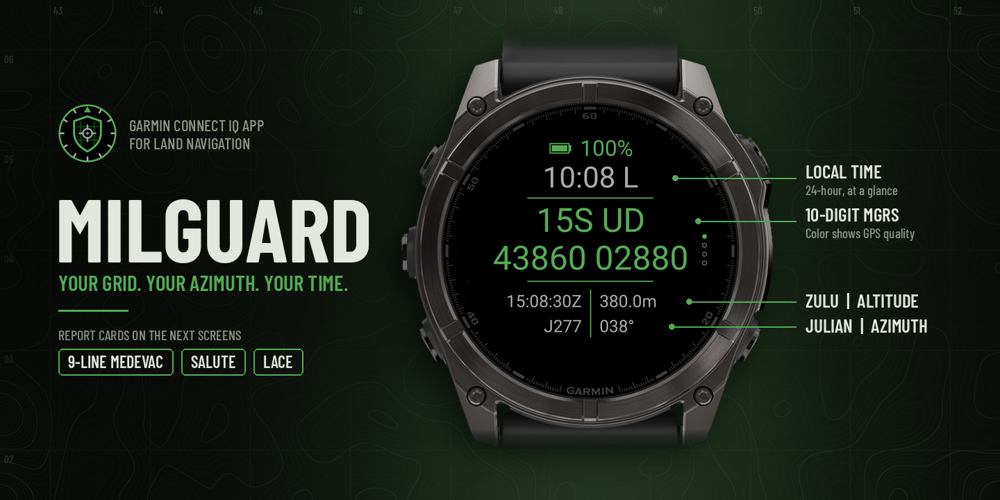
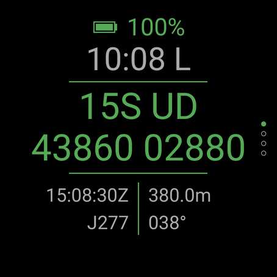
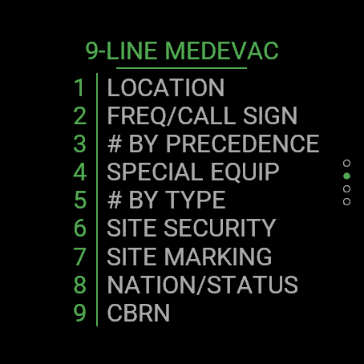
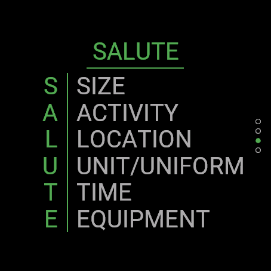
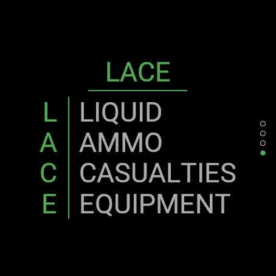

 <!-- markdownlint-disable MD033 MD041 -->

  

---

## MilGuard: Military Land Nav at a Glance

**Your grid. Your azimuth. Your time.**\
One screen. No menus. No scrolling.

MilGuard turns your Garmin into a field-ready land nav tool. Open it, get a GPS lock, and read your position the way you'd call it in.

### What You Get

- 10-digit MGRS grid (1-meter precision)
- Grid zone and 100km square up top
- Live azimuth from your watch's compass
- Altitude
- Local time and Zulu time side by side
- Julian date
- Battery level
- GPS quality by color: green = good fix, yellow = usable, red = no GPS

### Report Formats

Scroll with the up/down buttons (or swipe) to page from the main screen through three reference cards, one per screen:

- 9-Line MEDEVAC
- SALUTE
- LACE

### Built for the Field

- Muted tactical colors that won't light you up at night
- High-contrast text, readable in direct sun on MIP screens
- Layout adapts to your watch: Fenix, Epix, Instinct, Forerunner, Venu and more
- On Instinct models, battery sits in the corner window and GPS quality shows as text

---

*Built by a Soldier, for anyone who navigates by grid.*

> **Note:** Accuracy depends on your watch's GPS and compass calibration. Always confirm critical positions with a map and compass. MilGuard is not affiliated with or endorsed by the U.S. Army or Department of Defense.
>
>
   <table>
     <tr>
       <td align="center"></td>
       <td align="center"></td>
       <td align="center"></td>
       <td align="center"></td>
     </tr>
     <tr>
       <td colspan="4" align="center">Main screen, 9-Line MEDEVAC, SALUTE and LACE.</td>
     </tr>
   </table>

## License

MilGuard is released under the [MIT License](LICENSE).
## 

Looking for the original single-screen version? See the v1.0.1 branch.
