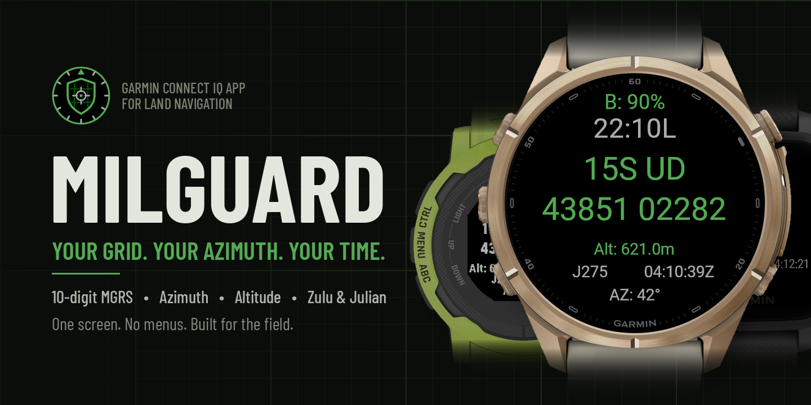
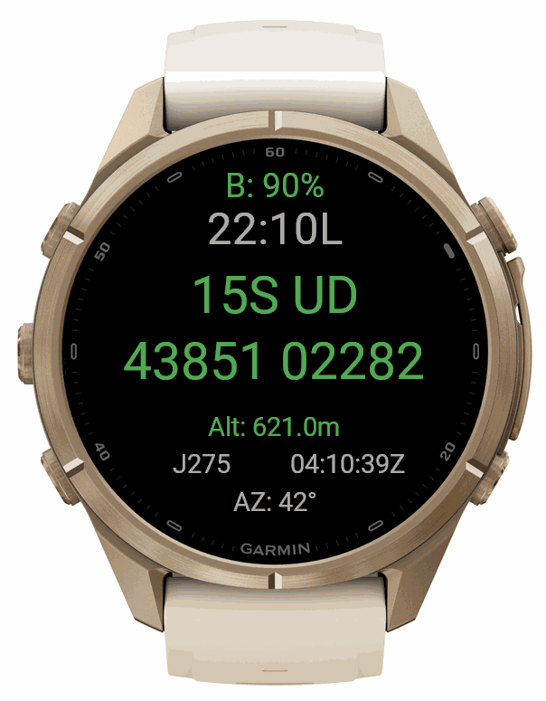
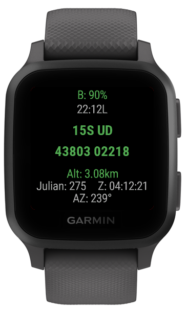
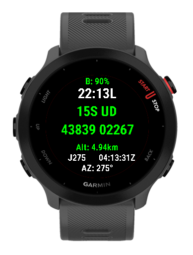
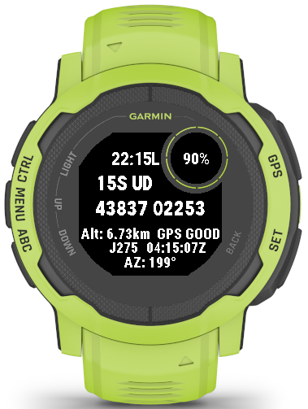
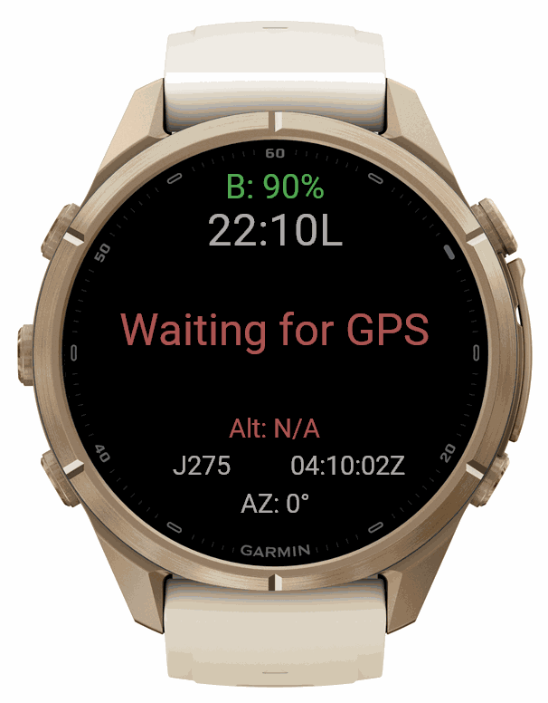
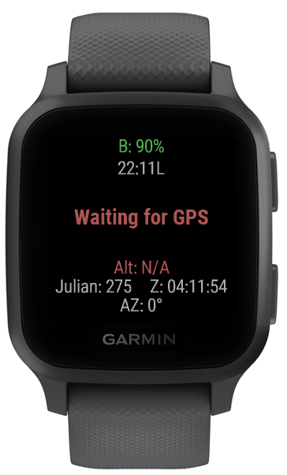
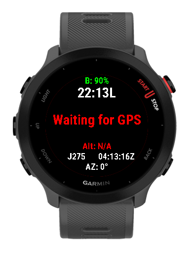
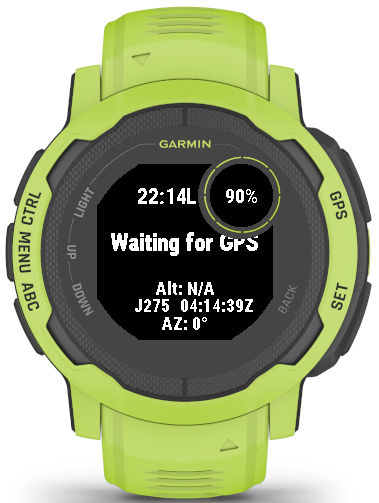

MILGUARD // MILITARY LAND NAV AT A GLANCE
=========================================

Your grid. Your azimuth. Your time.
One screen. No menus. No scrolling.

   15S UD 43851 02282  |  AZ 042  |  1410Z

MilGuard turns your Garmin into a field-ready land nav tool. Open it, get a GPS lock, and read your position the way you'd call it in.

[+] WHAT YOU GET
-----------------------------------------
:: 10-digit MGRS grid (1-meter precision)
:: Grid zone and 100km square up top
:: Live azimuth from your watch's compass
:: Altitude
:: Local time and Zulu time side by side
:: Julian date
:: Battery level
:: GPS quality by color: green = good fix, yellow = usable

[+] BUILT FOR THE FIELD
-----------------------------------------
:: Muted tactical colors that won't light you up at night
:: High-contrast text, readable in direct sun on MIP screens
:: Layout adapts to your watch: Fenix, Epix, Instinct, Forerunner, Venu and more
:: On Instinct models, battery sits in the corner window and GPS quality shows as text

Built by a Soldier, for anyone who navigates by grid.
=========================================

NOTE: Accuracy depends on your watch's GPS and compass calibration. Always confirm critical positions with a map and compass. MilGuard is not affiliated with or endorsed by the U.S. Army or Department of Defense.

<table>
  <tr>
    <th align="center">Fenix 8</th>
    <th align="center">Venu Sq</th>
    <th align="center">Forerunner 55</th>
    <th align="center">Instinct 2</th>
  </tr>
  <tr>
    <td align="center"></td>
    <td align="center"></td>
    <td align="center"></td>
    <td align="center"></td>
  </tr>
  <tr>
    <td align="center"></td>
    <td align="center"></td>
    <td align="center"></td>
    <td align="center"></td>
  </tr>
  <tr>
    <td colspan="4" align="center">Top: acquiring GPS. Bottom: GPS lock with live MGRS grid.</td>
  </tr>
</table>
